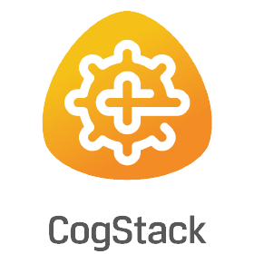

# Working with 
This repository contains all tools relevant to interacting with an NHS deployment of CogStack.

It contains easy to follow templates and instructions to interact and search CogStack.

__NOTE__ this section is currently in development. Let me know if there is anything 
else to add!

Tasks left TODO:
- [ ] CogStack Search
- [ ] CogStack Watcher Jobs
- [ ] MedCAT creating a model
- [ ] MedCAT unsupervised training a model
- [ ] MedCAT supervised training a model
- [ ] MedCAT annotating free text


## Setup

Users can follow these steps to quickly setup and deploy this repository on their machine.

Any code to enter in these instructions will be represented as `code to enter`.

Please replace anything in < > with your own

### Step 1: Clone this repository locally 

1. Enter the directory where you would like to store these files. `cd path/to/where/you/want/this/repository`

2. Clone the online repository: `git clone https://github.com/antsh3k/working_with_cogstack.git`
    
    Further instructions and self-help with git and git clone. Please visit this [link.](https://github.com/git-guides/git-clone)
    
    If you choose to use github desktop rather than the terminal please refer to the [official github desktop guides.](https://docs.github.com/en/desktop)

3. Optional: To update to the latest release of this repository: `git pull` 

### Step 2: Creating a virtual environment and required packages
__Windows__
1. Create a new virtual env: `python3 -m venv venv`
2. Load the virtual environment: `.\venv\Scripts\activate`
3. Install relevant packages and libraries: `pip install -r requirements.txt`


__Linux/MAC OS__
1. Create a new virtual env: `python3 -m venv venv`
2. Load the virtual environment: `source venv/bin/activate`
3. Install relevant packages and libraries: `pip install -r requirements.txt`

Optional: If no jupyter instance is installed.
1. In the main folder of this repository. Activate your virtual environment, using the (Step 2) command from your respective OS. 
2. Start jupyter notebook: `jupyter notebook`


### Step 3: Enter credentials and Login details
In the main folder of this repository you must populate the [credentials.py](credentials.py) file with your own CogStack hostnames, username and passwords.

If you have any questions or issues obtaining these details please contact your local CogStack administrator.


The credentials.py contents:
```
hosts = []  # This is a list of your cogstack elasticsearch instances.

# These are your login details (either via http_auth or API)
username = ''
password = ''
api_username = ''
api_password = ''
```

## Contents

## [How to search using CogStack](search)
This directory contains the basics search templates

## [How to create a watcher](watcher)
This directory contains the basics watcher job templates.

## [MedCAT](medcat)
This directory contains the all scripts required to run a MedCAT project.
 


### Demo
A demo application is available at [MedCAT](https://medcat.rosalind.kcl.ac.uk). This was trained on MIMIC-III to annotate
SNOMED-CT concepts. __Note:__ No supervised training has been provided to this model and therefore should only be used for demonstration
purposes only.

